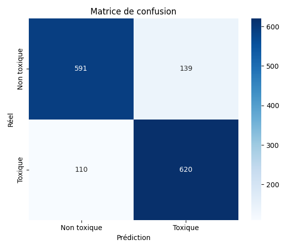
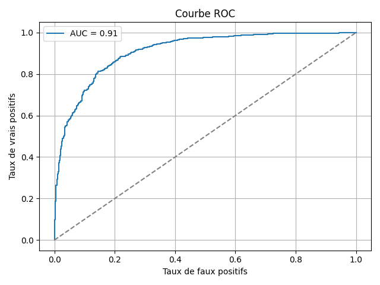
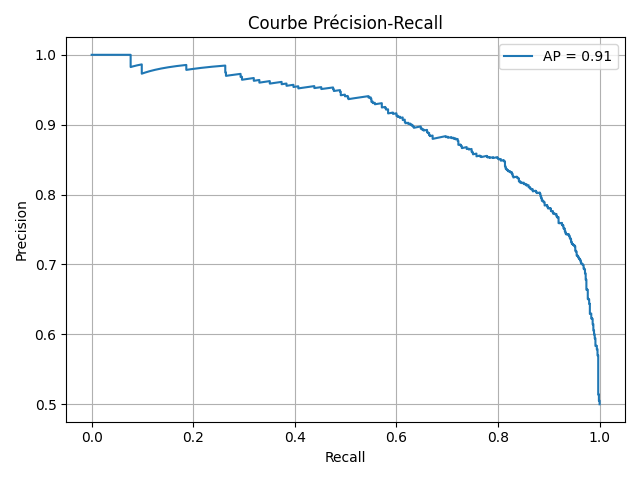

# Évaluation du modèle `logreg_toxic`

## Scores globaux
- **accuracy** : `0.8295`
- **balanced_accuracy** : `0.8295`
- **precision** : `0.8169`
- **recall** : `0.8493`
- **f1_score** : `0.8328`
- **roc_auc** : `0.9110`
- **average_precision** : `0.9079`

## Visualisations

---
_Généré avec `evaluate_model_with_features()`_
