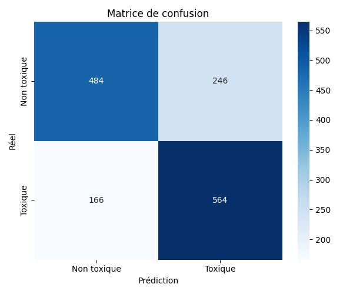

# Évaluation du modèle `nb_toxic`

## Scores globaux
- **accuracy** : `0.7178`
- **balanced_accuracy** : `0.7178`
- **precision** : `0.6963`
- **recall** : `0.7726`
- **f1_score** : `0.7325`
- **roc_auc** : `0.7942`
- **average_precision** : `0.7758`

## Visualisations

---
_Généré avec `evaluate_model_with_features()`_
