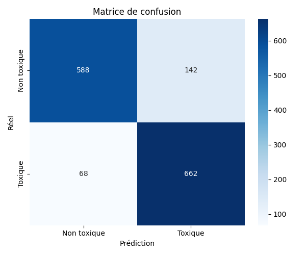
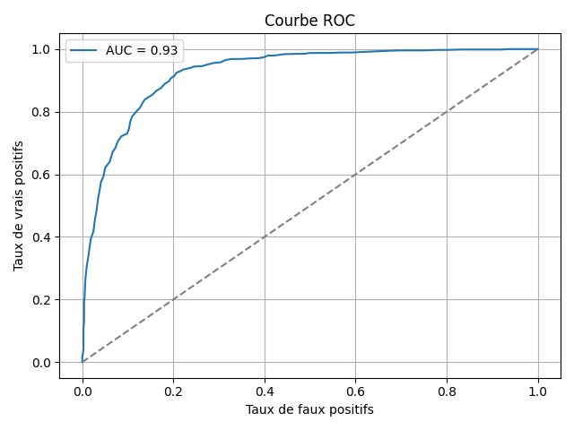
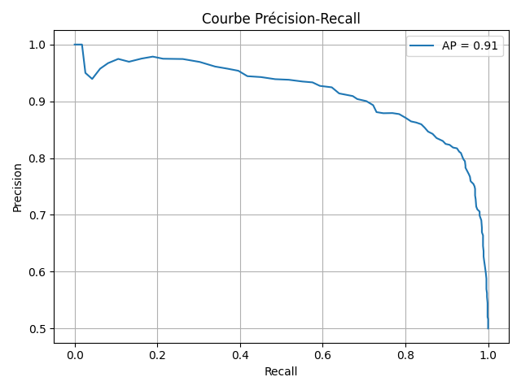

# Évaluation du modèle `rf_toxic`

## Scores globaux
- **accuracy** : `0.8562`
- **balanced_accuracy** : `0.8562`
- **precision** : `0.8234`
- **recall** : `0.9068`
- **f1_score** : `0.8631`
- **roc_auc** : `0.9264`
- **average_precision** : `0.9136`

## Visualisations

---
_Généré avec `evaluate_model_with_features()`_
